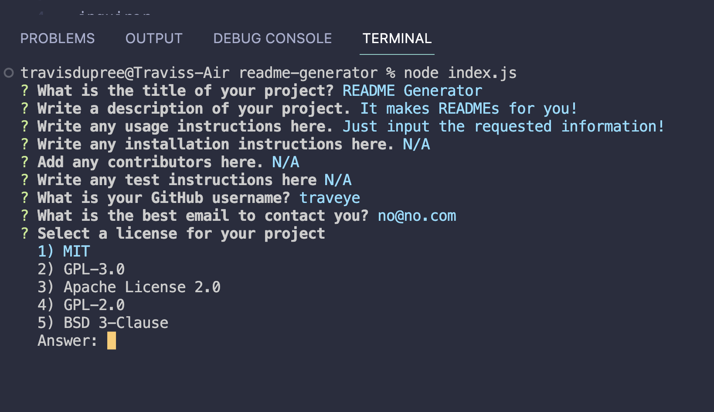
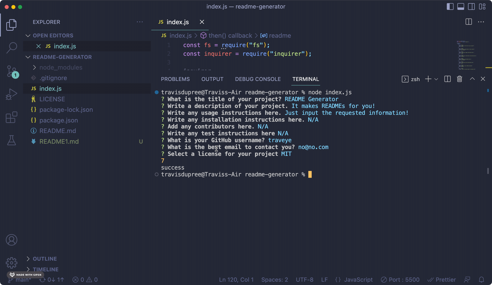

# README Generator

## Goals
This project was undertaken to demonstrate an abiltiy to use NPMs in a NODE.js environment. Using Inquirer, a questionairre would be generated for a user and once completed a README.md file would be generated. It was considered complete once:

- A user is presented with questions to provide their input for thier project Title, Description, Installation, Usage, Contributions, and Test sections.

- A user is presented with a list of License options. Additonally, the license selected will appear as a badge on the completed README.

- A user is able to enter their email and GitHub user name which will be added to a section titled Questions wiht information on how to contact the user.

- A table of contents will be generated which will act as links to the sections of the README.

## Implementation

The project began by initializing NPM and importing File Systems and Inquirer. I then constructed a questionaire using `Inquirer.prompt`. An image of the questions as they appear in the terminal is below. 

Then, I created a variable in which I stored a template of the completed README.md. This was saved a template literal so that the user answers could be easily passed into the template to generate the final file. I also created a switch statement so in order to capture the correct license badge based on the user's selection. Once all questions are answered, I used `fs.WriteFile` to creat the final README1.md. You can view this process in the GIFs below. 

You can check out the the repository [here](https://github.com/Traveye/readme-generator).

## Credits
NA

## License
MIT

